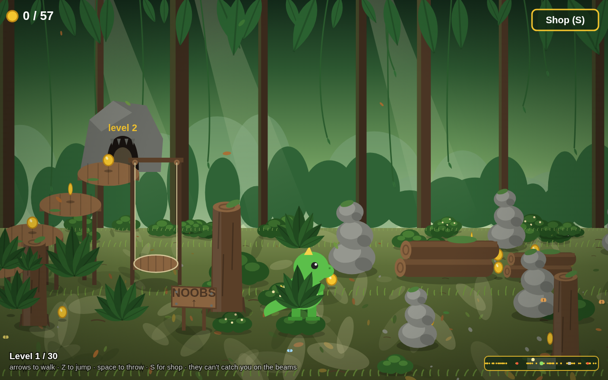

# Dinoland

A little browser game about a baby dinosaur in a prehistoric jungle. Collect coins, buy a spear in the weapon shop, dodge the hunters and their dogs, climb the beams (or take the lift) to the cave, and make it through 30 levels to the disco finale.

Play it at https://jankeesvw.github.io/dinoland/

Controls: arrow keys to walk, Z to jump, space to throw, S for the shop.

It's one `index.html` with a canvas and plain JavaScript, no build step.

## How it was made

The game was built during one class at a primary school, one prompt at a time in Claude Code. The skill they used is in [`.claude/skills/game/SKILL.md`](.claude/skills/game/SKILL.md) (translated from Dutch). It was written for the class repo, so it refers to helper scripts like `bin/new-game` and `bin/serve` that aren't in this repo.
